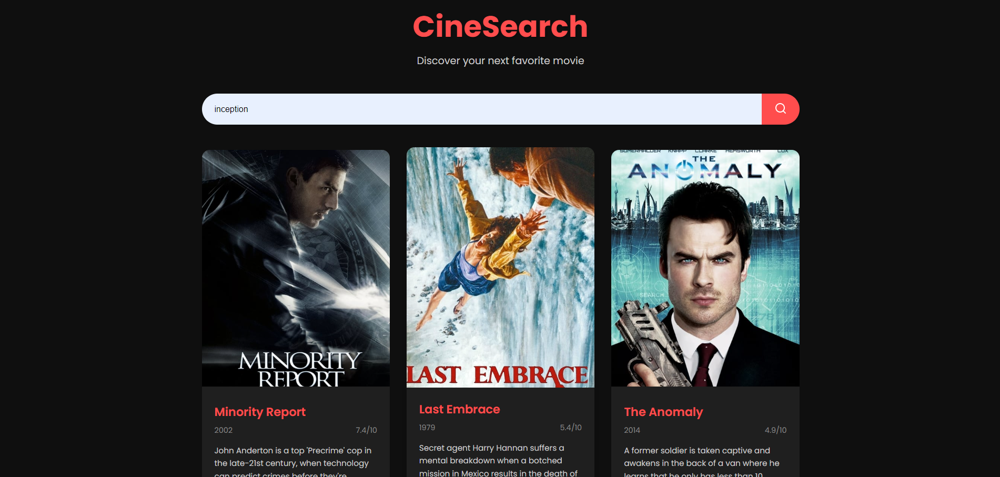

# Movie_Recommendation_system


## Overview
this project is a movie recommendation system that combines multiple algorithms to provide personalized movie suggestions. The system utilizes content-based filtering, collaborative filtering, neural collaborative filtering, and gradient boosting techniques to generate accurate and diverse recommendations.

## Features
- **Hybrid Approach**: Combines multiple recommendation algorithms for improved accuracy and diversity.
- **Content-Based Filtering**: Utilizes movie features and DistilBERT embeddings for semantic similarity.
- **Collaborative Filtering**: Implements memory-efficient SVD for user-item interactions.
- **Neural Collaborative Filtering**: Employs a deep learning model for capturing complex user-item relationships.
- **Gradient Boosting**: Uses LightGBM for feature-based recommendations.
- **Efficient Data Processing**: Implements memory-efficient techniques for handling large datasets.
- **Model Evaluation**: Includes functions to evaluate individual model contributions to recommendations.
- **User-Friendly Interface**: Provides an intuitive web interface for users to search and discover movies.
- **Real-Time Recommendations**: Generates recommendations on-the-fly based on user input.

## Technologies Used
### Backend
- Python 3.9.13
- Flask (Web framework)
- pandas
- numpy
- scikit-learn
- PyTorch
- Transformers (Hugging Face)
- LightGBM
- NLTK
- joblib

### Frontend
- HTML5
- CSS3
- JavaScript (ES6+)
- Fetch API for AJAX requests

## Installation
1. Clone the repository:
   ```
   git clone https://github.com/69amirhossein69/Movei_Recommend_system.git

   ```
2. Install the required packages:
   ```
   pip install -r requirements.txt
   ```
3. Download the required datasets and place them in the `data` directory:
   - movies_metadata.csv
   - credits.csv
   - keywords.csv
   - ratings.csv

## Usage
1. Start the Flask server:
   ```
   python app.py
   ```
2. Open a web browser and navigate to `http://localhost:5000`
3. Enter a movie title in the search bar to get recommendations

## Project Structure
- `app.py`: Flask application serving as the backend API.
- `models/`: Directory containing implementation of various recommendation models.
  - `content_based.py`: Content-based filtering using DistilBERT embeddings.
  - `collaborative_filtering.py`: Memory-efficient SVD implementation.
  - `neural_cf.py`: Neural Collaborative Filtering model.
  - `lightgbm_model.py`: LightGBM model for feature-based recommendations.
- `preprocessing/`: Scripts for data processing and feature engineering.
- `static/`: Frontend assets (CSS, JavaScript, images).
- `templates/`: HTML templates for the web interface.
- `utils.py`: Utility functions for data manipulation and evaluation.
- `requirements.txt`: List of required Python packages.

## API Endpoints
- `POST /recommend`: Accepts a movie title and returns a list of recommended movies.

## Frontend Components
- `index.html`: Main page with search functionality and movie display.
- `styles.css`: Stylesheet for the web interface.
- `script.js`: JavaScript file handling user interactions and API calls.

# UI



## Model Details
1. **Content-Based Filtering**: Uses DistilBERT to create embeddings for movie features.
2. **Collaborative Filtering**: Implements a memory-efficient SVD algorithm.
3. **Neural Collaborative Filtering**: A multi-layer perceptron model with embedding layers for users and movies.
4. **LightGBM**: A gradient boosting model that uses engineered features for recommendations.

## Contributing
Contributions to improve CineSearch are welcome. Please follow these steps:
1. Fork the repository
2. Create a new branch (`git checkout -b feature/your-feature`)
3. Make your changes and commit them (`git commit -am 'Add some feature'`)
4. Push to the branch (`git push origin feature/your-feature`)
5. Create a new Pull Request

## License
This project is licensed under the MIT License - see the [LICENSE](LICENSE) file for details.

## Acknowledgments
- The MovieLens dataset for providing the movie data
- Hugging Face for the Transformers library
- The Movie Database (TMDb) for additional movie information and posters
- The creators and maintainers of the various libraries used in this project
